# Data model

Authoritative spec: [`idea.md`](../idea.md) §7, §8, §11. This document is the reference for the schema created by the Kysely migrations (Tasks 05–06) and kept in sync as the schema evolves.

## Conventions

- Primary keys are `UUID DEFAULT gen_random_uuid()` unless noted.
- All timestamps are `TIMESTAMPTZ`; `created_at DEFAULT now()`. `updated_at` is application-managed (no DB triggers).
- Tables and columns are `snake_case`. Database encoding is UTF-8.
- Enumerations are enforced with `CHECK` constraints (listed per table below).
- **Imprecise dates** use `date_from` / `date_to` / `year_from` / `year_to` + `date_precision`. An unknown exact date is **never** stored as a fabricated `January 1` (idea.md §8).
- **Merged or soft-deleted people** (`merged_into_person_id`, `deleted_at`) are never treated as active graph nodes (idea.md §8).
- **Derived kinship** (sibling, cousin, uncle/aunt, grandparent) is **computed** from parent-child edges + family unions via recursive CTEs — never stored as canonical rows (idea.md §11).

## Three data layers (idea.md §7)

```text
Layer 1  Immutable submissions     invites, submissions, submission_people,
                                    submission_relationships, consents
Layer 2  Staging / candidates      match_candidates, submission_people.matched_person_id,
                                    submission_people.resolution_status
Layer 3  Canonical graph           people, person_names, places, person_events,
                                    parent_child_relationships, family_unions,
                                    union_partners, sources, evidence, person_merge_history
Cross-cutting                      audit_log, service_request_nonces, idempotency_keys
```

Promotion from Layer 1 → Layer 3 is always an explicit admin action; the original submission payload is immutable.

## ER diagram

```mermaid
erDiagram
    invites ||--o{ submissions : "invite_id"
    submissions ||--o{ submission_people : "submission_id"
    submissions ||--o{ submission_relationships : "submission_id"
    submissions ||--o{ consents : "submission_id"
    submissions ||--o{ sources : "submission_id"
    submission_people }o--o| people : "matched_person_id"
    submission_people ||--o{ match_candidates : "submission_person_id"
    people ||--o{ match_candidates : "canonical_person_id"

    people ||--o{ person_names : "person_id"
    people ||--o{ person_events : "person_id"
    places ||--o{ person_events : "place_id"
    places ||--o{ places : "parent_place_id"
    sources ||--o{ person_names : "source_id"

    people ||--o{ parent_child_relationships : "parent_id"
    people ||--o{ parent_child_relationships : "child_id"
    family_unions ||--o{ parent_child_relationships : "family_union_id"
    family_unions ||--o{ union_partners : "union_id"
    people ||--o{ union_partners : "person_id"

    sources ||--o{ evidence : "source_id"
    people ||--o{ person_merge_history : "source/target"
    people ||--o| people : "merged_into_person_id"

    invites {
        uuid id PK
        text token_hash UK "sha256 hex; plain token never stored"
        text recipient_label
        text campaign
        timestamptz expires_at
        int max_submissions
        int used_submissions
        timestamptz revoked_at
        timestamptz created_at
    }
    submissions {
        uuid id PK
        uuid invite_id FK
        text status "draft|pending|in_review|processed|rejected|spam"
        jsonb original_payload "immutable"
        text client_fingerprint "HMAC of IP, never raw IP"
        text spam_reason
        timestamptz submitted_at
        timestamptz processing_started_at
        timestamptz processed_at
        timestamptz rejected_at
        timestamptz created_at
        timestamptz updated_at
    }
    submission_people {
        uuid id PK
        uuid submission_id FK
        text local_key "SELF|FATHER|MOTHER|...|SIBLING_1|CHILD_1|RELATIVE_1"
        text first_name
        text middle_name
        text surname
        text birth_surname
        text nickname
        int birth_year_from
        int birth_year_to
        int death_year_from
        int death_year_to
        text birthplace_text
        text residence_text
        text living_status "living|deceased|unknown"
        text normalized_name
        uuid matched_person_id FK
        text resolution_status "pending|created|linked|deferred|ignored"
        timestamptz created_at
    }
    submission_relationships {
        uuid id PK
        uuid submission_id FK
        text from_local_key
        text to_local_key
        text relationship_type "parent|partner|sibling|child|other"
        text notes
    }
    consents {
        uuid id PK
        uuid submission_id FK
        text consent_type "data_processing|contact|family_visibility|public_display|media_usage"
        text consent_version
        boolean accepted
        timestamptz accepted_at
        timestamptz withdrawn_at
    }
    people {
        uuid id PK
        text living_status "living|deceased|unknown"
        text privacy_level "private|family|public"
        text notes
        uuid merged_into_person_id FK
        timestamptz deleted_at
        timestamptz created_at
        timestamptz updated_at
    }
    person_names {
        uuid id PK
        uuid person_id FK
        text first_name
        text middle_name
        text surname
        text birth_surname
        text nickname
        text normalized_name
        text transliterated_name
        text name_type "primary|birth|married|alias|nickname|transliterated"
        boolean is_preferred
        uuid source_id FK
        timestamptz created_at
    }
    places {
        uuid id PK
        text name
        text normalized_name
        text place_type "country|region|municipality|settlement"
        uuid parent_place_id FK
        double latitude
        double longitude
        text country_code
        timestamptz created_at
    }
    person_events {
        uuid id PK
        uuid person_id FK
        text event_type "birth|death|residence|migration|occupation|education"
        uuid place_id FK
        text value "occupation/education text"
        date date_from
        date date_to
        int year_from
        int year_to
        text date_precision "exact|month|year|approximate|range|unknown"
        timestamptz created_at
    }
    parent_child_relationships {
        uuid id PK
        uuid parent_id FK
        uuid child_id FK
        text relationship_type "biological|adoptive|step|foster|guardian|unknown"
        uuid family_union_id FK
        text verification_status "proposed|confirmed|disputed|rejected"
        smallint confidence "0-100"
        timestamptz created_at
        timestamptz updated_at
    }
    family_unions {
        uuid id PK
        text union_type "marriage|partnership|unknown"
        timestamptz created_at
    }
    union_partners {
        uuid id PK
        uuid union_id FK
        uuid person_id FK
        timestamptz created_at
    }
    sources {
        uuid id PK
        text source_type "questionnaire|interview|birth_certificate|..."
        text title
        text description
        uuid submission_id FK
        timestamptz created_at
    }
    evidence {
        uuid id PK
        uuid source_id FK
        text subject_type "person|person_name|person_event|parent_child_relationship|family_union"
        uuid subject_id
        text assertion
        text stance "supports|disputes"
        smallint confidence
        text notes
        timestamptz created_at
    }
    match_candidates {
        uuid id PK
        uuid submission_person_id FK
        uuid canonical_person_id FK
        smallint score
        jsonb reasons
        text status "pending|accepted|rejected|deferred"
        text reviewed_by "admin email"
        timestamptz reviewed_at
        timestamptz created_at
    }
    person_merge_history {
        uuid id PK
        uuid source_person_id FK
        uuid target_person_id FK
        text actor_id
        text reason
        jsonb snapshot
        timestamptz created_at
    }
    audit_log {
        uuid id PK
        text actor_type "admin|service|system|public"
        text actor_id
        text action
        text entity_type
        uuid entity_id
        text request_id
        jsonb metadata "safe metadata only"
        timestamptz created_at
    }
    service_request_nonces {
        text nonce PK
        text service_id
        timestamptz expires_at
        timestamptz created_at
    }
    idempotency_keys {
        text key PK
        text service_id
        text request_hash
        int response_status
        jsonb response_body
        timestamptz created_at
        timestamptz expires_at
    }
```



## Table notes

### Layer 1 — immutable submissions

Staging children (`submission_people`, `submission_relationships`, `consents`) reference `submissions` with `ON DELETE CASCADE` — deleting a submission (rare, admin cleanup) removes its staging rows atomically. Canonical tables never cascade from staging.

**`invites`** — invitation tokens. Only `sha256hex(token)` is stored in `token_hash` (UNIQUE); the plain token exists only in the creation response. Constraints: `CHECK (max_submissions > 0)`, `CHECK (used_submissions <= max_submissions)`. Consumed under a row lock during submission (Task 12).

**`submissions`** — one questionnaire submission. `original_payload JSONB NOT NULL` is **immutable** after the row leaves `draft`. `status` ∈ `{draft, pending, in_review, processed, rejected, spam}` (`CHECK`). `client_fingerprint` is an HMAC of the IP, never the raw IP. State transitions are validated server-side (Task 18).

**`submission_people`** — each person described in a submission, keyed by `local_key` (`UNIQUE (submission_id, local_key)`). `living_status` ∈ `{living, deceased, unknown}`. `resolution_status` ∈ `{pending, created, linked, deferred, ignored}` drives the review workflow. `matched_person_id → people(id)` (FK added in Task 06). Year fields have `CHECK (…_from <= …_to)` when both present.

**`submission_relationships`** — relationships between local keys within one submission. `relationship_type` ∈ `{parent, partner, sibling, child, other}`. `UNIQUE (submission_id, from_local_key, to_local_key, relationship_type)`.

**`consents`** — granular consent records. `consent_type` ∈ `{data_processing, contact, family_visibility, public_display, media_usage}`; `consent_version` pins the shown text version. `data_processing` is required to submit; the rest are optional (idea.md §9).

### Layer 3 — canonical graph

**`people`** — canonical person node. `privacy_level` ∈ `{private, family, public}` (default `private`); `living_status` ∈ `{living, deceased, unknown}`. A row with `merged_into_person_id` set or `deleted_at` set is **not** an active node and is excluded from search, tree, and exports.

**`person_names`** — multiple names per person. `name_type` ∈ `{primary, birth, married, alias, nickname, transliterated}`. Partial unique index enforces **one preferred name per `(person_id, name_type)`** where `is_preferred`. Stores both `normalized_name` and `transliterated_name` (Task 19). `source_id → sources`.

**`places`** — hierarchical places (`country → region → municipality → settlement`) via `parent_place_id`. Deduplicated by normalized name within a parent/type (unique index). Coordinates optional.

**`person_events`** — life events. `event_type` ∈ `{birth, death, residence, migration, occupation, education}`. Dates use `date_from/date_to/year_from/year_to` + `date_precision` ∈ `{exact, month, year, approximate, range, unknown}`; **no fabricated exact dates**. `CHECK (year_from <= year_to)` when both present.

**`parent_child_relationships`** — the core directed edges. `relationship_type` ∈ `{biological, adoptive, step, foster, guardian, unknown}`; `verification_status` ∈ `{proposed, confirmed, disputed, rejected}`; `confidence` 0–100. `CHECK (parent_id <> child_id)` and `UNIQUE (parent_id, child_id, relationship_type)`. Ancestry-cycle prevention runs in the same transaction as inserts/confirmations (Task 22): the cycle check considers `proposed` + `confirmed` edges and ignores `disputed`/`rejected`.

**`family_unions`** + **`union_partners`** — partnerships. `union_type` ∈ `{marriage, partnership, unknown}`. `union_partners` has `UNIQUE (union_id, person_id)`; a person may belong to many unions. There is deliberately **no** `spouse_id` on `people` (idea.md §8). Children attach to a union through `parent_child_relationships.family_union_id`.

**`sources`** — provenance. `source_type` ∈ `{questionnaire, interview, birth_certificate, marriage_certificate, death_certificate, church_register, family_document, photograph, grave_marker, other}`. One `questionnaire` source per submission (idempotent helper, Task 21).

**`evidence`** — links a source to an assertion about a subject row. `subject_type` ∈ `{person, person_name, person_event, parent_child_relationship, family_union}`; `stance` ∈ `{supports, disputes}`. Many sources may support/dispute one assertion; a `disputes` row **never** auto-overwrites subject data (idea.md §8) — resolution is a separate explicit admin edit. `source_id` is `ON DELETE RESTRICT`.

### Layer 2 — staging / candidates

**`match_candidates`** — scored links between a `submission_person` and a canonical person. `UNIQUE (submission_person_id, canonical_person_id)`; `reasons JSONB` holds explainable, Bulgarian-described scoring reasons (idea.md §10). `status` ∈ `{pending, accepted, rejected, deferred}`. **No automatic merge** is ever performed from a score (idea.md §7, §10).

**`person_merge_history`** — audit of merges. `snapshot JSONB` captures the source person's full pre-merge state. Merges are fully transactional (Task 25).

### Cross-cutting

**`audit_log`** — append-only. `actor_type` ∈ `{admin, service, system, public}`. `metadata JSONB` holds **safe** metadata only — never secrets, raw passwords, full Turnstile tokens, or raw IPs (idea.md §8).

**`service_request_nonces`** — replay protection for HMAC requests (idea.md §4). Expired rows are pruned periodically.

**`idempotency_keys`** — stores the response for a `(key, request_hash)` so a replay returns the same result; a same-key/different-body request is a 409 conflict (idea.md §4). Expired rows pruned periodically.

## Enum summary

| Domain | Values |
|---|---|
| submission status | draft, pending, in_review, processed, rejected, spam |
| submission_people resolution | pending, created, linked, deferred, ignored |
| living status | living, deceased, unknown |
| privacy level | private, family, public |
| person_names type | primary, birth, married, alias, nickname, transliterated |
| place type | country, region, municipality, settlement |
| event type | birth, death, residence, migration, occupation, education |
| date precision | exact, month, year, approximate, range, unknown |
| parent-child type | biological, adoptive, step, foster, guardian, unknown |
| verification status | proposed, confirmed, disputed, rejected |
| union type | marriage, partnership, unknown |
| source type | questionnaire, interview, birth_certificate, marriage_certificate, death_certificate, church_register, family_document, photograph, grave_marker, other |
| evidence stance | supports, disputes |
| consent type | data_processing, contact, family_visibility, public_display, media_usage |
| match candidate status | pending, accepted, rejected, deferred |
| audit actor type | admin, service, system, public |
